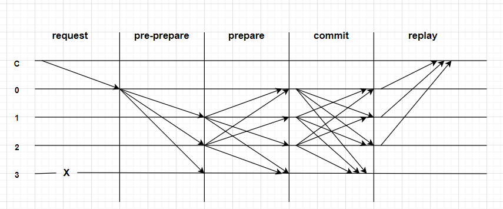

# 共识算法介绍

共识算法是指在分布式场景中，多个节点为了达成相同的数据状态而运行的一种分布式算法。 在分布式场景中，可能出现网络丢包、时钟漂移、节点宕机、节点作恶等等故障情况，共识算法需要能够容忍这些错误，保证多个节点取得相同的数据状态。

根据使用场景的不同，又可将共识算法分为公链共识、联盟链共识两类。本链为联盟链，采用的是联盟链共识算法中的PBFT共识算法。

## PBFT共识算法

#### 角色划分

- **Client**：客户端节点，负责发送交易请求。
- **Primary**: 主节点，负责将交易打包成区块和区块共识，每轮共识过程中有且仅有一个Primary节点。
- **Replica**: 副本节点，负责区块共识，每轮共识过程中有多个Replica节点，每个Replica节点的处理过程类似。

其中，Primary和Replica节点都属于共识节点。

#### 算法流程

PBFT 算法的基本流程主要有以下四步：

1. 客户端发送请求给主节点

2. 主节点广播请求给其它节点，节点执行PBFT算法的**三阶段共识流程**。

3. 节点处理完三阶段流程后，返回消息给客户端。

4. 客户端收到来自 f+1 个节点的相同消息后，代表共识已经正确完成

   

#### 三阶段共识流程

**预准备**：领导者提出提案，向所有副本广播。

**准备**：每个副本验证提案，如果合法，将准备消息广播给其他副本。

**提交**：每个副本接收到足够多的准备消息后，发送提交消息。一旦收到足够多的提交消息，提案被视为已达成共识。

