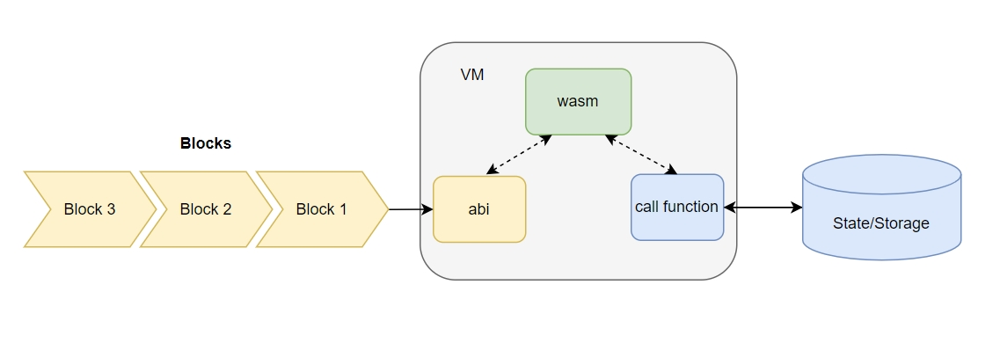
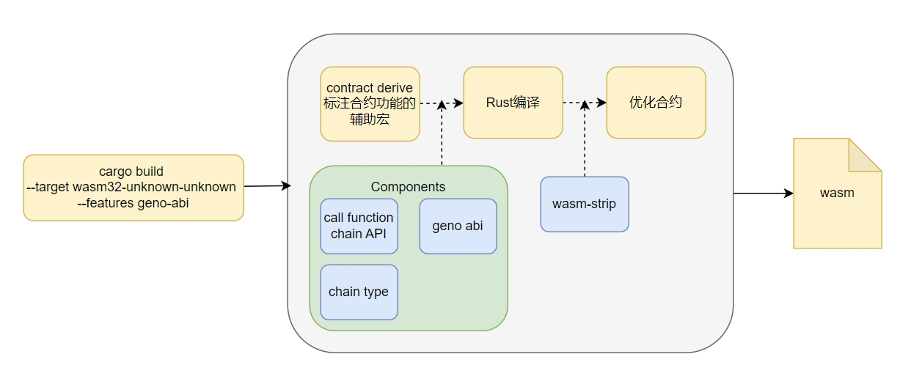

# 合约虚拟机

## 智能合约虚拟机

智能合约虚拟机赋予了区块链运行去中心化应用（Dapp）的能力。它让区块链演化为“操作系统”，孕育出繁荣的Dapp生态。一款优秀的VM不仅仅是要完成确定、高效、安全地执行合约字节码的功能，它应该足够通用，能最大化节省开发者的成本，甚至能形成独立的开发者生态。从架构上来说，虚拟机为智能合约提供计算资源和运行容器，区块链的共识、执行模块与虚拟机是完全解耦的。

WebAssembly (Wasm) 是一种可移植的二进制指令格式，旨在为基于栈的虚拟机提供高效执行。它最初是为了在 Web 浏览器中运行高性能应用程序而设计的，作为 JavaScript 的补充，但它的应用范围已经远远超出了 Web 浏览器。

Wasm 非常适合用作智能合约虚拟机，并且已经在一些区块链平台中得到应用。 相比于传统的虚拟机，Wasm 具有以下优势：
* 高性能: Wasm 的高效执行可以提高智能合约的运行速度，降低交易成本。
* 多语言支持: 开发者可以使用自己熟悉的编程语言编写智能合约，降低了开发门槛。
* 安全性: Wasm 的沙盒环境可以提高智能合约的安全性，防止恶意代码攻击。
* 可移植性: 使用 Wasm 作为虚拟机可以更容易地将智能合约部署到不同的区块链平台上。

Geno目前支持Wasm虚拟机。当区块中的交易被发送至虚拟机时，虚拟机先将解析交易中的智能合约使用的参数；在运行智能运行时，通过数据访问接口获取运行时必要的数据（例如，链的高度、时间、发送者等），最后将交易执行结果存储到链上。

## 智能合约
Geno的智能合约语言是基于Rust语言的宏系统实现的eDSL————嵌入式领域特定语言。

宏在 Rust 语言中是一种功能，能够在编译实际代码之前按照自定义的规则展开原始代码，从而能够达到修改原始代码的目的。从元编程的角度理解，宏就是“生成代码的代码”。通过 Rust 语言的宏系统，不仅能够实现模式替换功能，甚至还能够控制编译器的行为、设计自己的语法从而实现 eDSL，而 Geno的智能合约正是基于 Rust 语言的宏系统实现的 eDSL。

在整体架构中，Cargo面向开发者的命令行辅助工具，帮助开发者创建及构建智能合约。在智能合约创建阶段，它能够根据用户选定的智能合约类型根据模板自动配置编译选项及外部依赖，并生成abi等辅助代码；在智能合约构建阶段，Rust编译器负责责收集编译元信息并进行跨平台构建，将智能合约编译为 Wasm 格式字节码。基本构建完成后，还会使用 wasm-opt、wasm-strip 等工具对生成的字节码进行效率和体积上的进一步优化。
