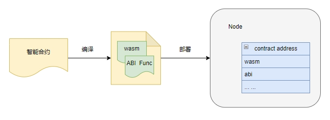
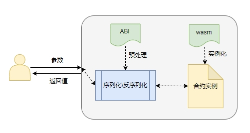

# 合约交互——ABI

## Geno ABI
智能合约相关数据在区块链上存储的格式都是字节码的形式，用户是无法直接阅读与操作的；虽然字节码提高程序的效率，但是对用户则是不友好的。我们通过`Geno ABI`描述智能合约的接口，包括字段名称、字段类型、方法名称、参数名称、参数类型、方法返回值类型等。`Geno ABI`由创建合约时生成，用户借助`Geno ABI`可以直接使用`Json`格式的数据与合约进行交互；

## Geno ABI 框架
我们编译智能合约的源码，会根据合约中标记同时生成和合约`ABI`相关解析函数，这些函数也会存入智能合约中。在我们要按照合约的时候，由链上解析出这些函数，然后生成`Geno ABI`文件，存到合约账户树下。

如果用户要调用智能合约时，输入的参数可以直接使用json，然后由schema转换为智能合约可以识别的字节码；智能合约的返回值也可以由schema转换为方便用户阅读的json格式。
用户所有和智能合约相关的操作，都是使用json，为什么是使用json。因为json是完全独立于编程语言的文本格式来存储和表示数据。简洁和清晰的层次结构使得json成为理想的数据交换语言。易于人阅读和编写，同时也易于机器解析和生成。

## Geno ABI定义

## Geno ABI类型对照表