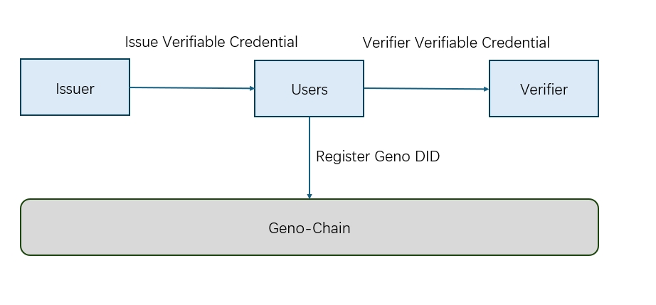

# 分布式数字身份与可验证凭证


在当今数字化时代，您的身份信息在网络中的管理和验证方式正发生着重大变革。分布式数字身份（DID）就像是您在数字世界独一无二的 “身份证”，它不依赖于传统的中心化机构，而是基于先进的区块链或分布式账本技术。这意味着您能完全掌控自己的身份标识，每个 DID 都配有专属的加密材料，像公私钥对，用于确保只有您能证明 “这就是您”。

可验证凭证（VC）则如同您各种实体证件的数字化分身，比如学历证书、驾驶证等。它由权威的发行者以数字签名的方式签发，包含了关于您的关键属性声明。凭借密码学技术，其他人在收到您的 VC 时，能够快速、准确地验证其真实性、完整性，并且确认发行者身份，无需再通过繁琐的第三方中介，轻松实现跨不同领域、平台的信任交互。


## Geno身份架构



## 创建Geno分布式数字身份（DID）


根据W3C去中心化标识符工作组发布[DID规范](https://www.w3.org/TR/2022/REC-did-core-20220719/)

GENO定义了去中心化标识符 (DIDs)，这是一种新型标识符，支持可验证的、去中心化的数字身份。一个 DID 可以标识由 DID 控制者决定的任何主题（例如个人、组织、事物、数据模型、抽象实体等）
如：
```
{
"@context": [
   "https://www.w3.org/ns/did/v1",
   "https://w3id.org/security/suites/ed25519-2020/v1"
 ]
  "id": "did:geno:0xc017df7569d89e2785466A347B5192F4FbF2594b",
  "authentication": [{
     "id": "did:geno:0xc017df7569d89e2785466A347B5192F4FbF2594b#keys-1",
     "type": "Ed25519VerificationKey2020",
     "controller": "0x70997970C51812dc3A010C7d01b50e0d17dc79C8",
     "publicKeyMultibase": "zH3C2AVvLMv6gmMNam3uVAjZpfkcJCwDwnZn6z3wXmqPV"
   }]
 }
```


## 获取与使用可验证凭证（VC）
根据VC 规范[Verifiable Credentials规范](https://www.w3.org/TR/vc-data-model/)

**签发 VC**

当有机构或个人向您发放 VC 时，您会收到一份类似 JSON 格式的数据文件。例如，一份学历 VC ：


```
{
  
  "@context": [
    "https://www.w3.org/2018/credentials/v1",
    "https://www.w3.org/2018/credentials/examples/v1"
  ],
  "id": "http://example.edu/credentials/1872",
  "type": ["VerifiableCredential", "AlumniCredential"],
  "issuer": "https://example.edu/issuers/565049",
  "issuanceDate": "2025-01-01T19:23:24Z",
  "credentialSubject": {
    "id": "did:example:ebfeb1f712ebc6f1c276e12ec21",
    "alumniOf": { 
    "issuer": "did:geno:0xc017df7569d89e2785466A347B5192F4FbF2594b",
     "credentialSubject": { 
     "id": "did:geno:0xc017df7569d89e2785466A347B5192F4FbF2594b", 
     "degree": "Bachelor" }, 
     "expirationDate": "2024-12-31" },
  "proof": {
    "type": "RsaSignature2018",
    "created": "2017-06-18T21:19:10Z",
    "proofPurpose": "assertionMethod",
    "verificationMethod": "https://example.edu/issuers/565049#key-1",
    "jws": "eyJhbGciOiJSUzI1NiIsImI2NCI6ZmFsc2UsImNyaXQiOlsiYjY0Il19TCYt5X
      sITJX1CxPCT8yAV-TVkIEq_PbChOMqsLfRoPsnsgw5WEuts01mq-pQy7UJiN5mgRxDWUc
      X16dUEMGlv50aqzpqh4Qktb3rk-BuQy72IFLOqV0G_zS245-kronKb78cPN25DGlcTwLtj
      PAYuNzVBAh4vGHSrQyHUdBBPM"
  }
}
```

您只需正常接收并保存好这份数据即可。

**验证 VC 有效性**

若您需要使用这份 VC，比如向新的机构证明您的学历，对方可能要求您验证其真实性。这时：

经过Geno-Sdk vc验证器 [SDK]()您就可以放心地使用这份 VC 来证明自己的资质。


> 💡**注意**  
> *保护您的密钥，私钥一旦丢失，无法找回。因为分布式数字身份强调去中心化与自主掌控，没有中心化机构帮您重置密码。所以务必按照前文提示，安全存储私钥，您可以考虑多重备份，分别存储在不同安全位置*  


## 总结

分布式数字身份 DID 和可验证凭证 VC 为您带来全新、便捷、安全的数字身份体验。通过简单几步，您就能创建并管理自己的数字身份，同时凭借精心设计的安全隐私机制，确保您的权益不受侵害。
