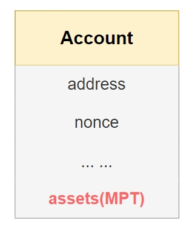
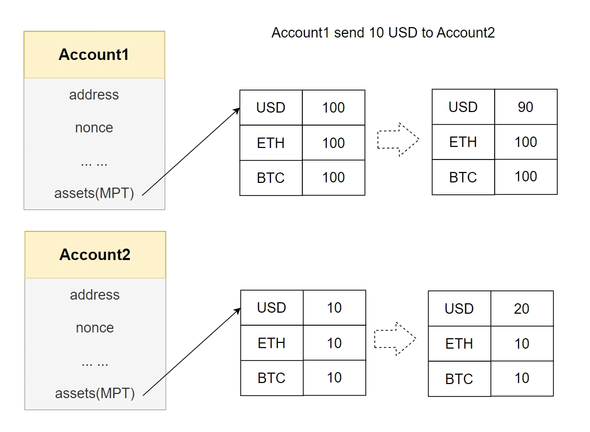
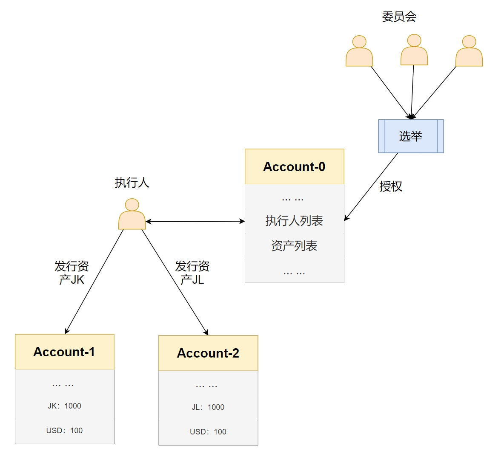
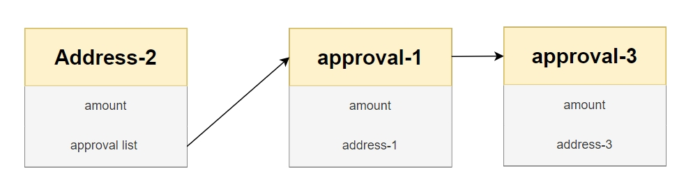

# 原生链上资产

## 介绍
客户在使用话费、信用卡、搭飞机、购物消费时会产生手机积分、信用卡积分或航空积分。积分兑换业务就是把客户闲散的待过期的积分进行有效利用的业务，有效利用形式包括兑换礼品、积分回收兑现等多种形式。

通过分布式区块链记账技术，打造公开、透明、安全、可信的积分价值体系，从而助力传统产业的转型升级和各地数字经济的蓬勃发展。

积分业务是比较常见，规模十分庞大，场景也很丰富。所以对于链的各方面要求也比较高；为了提高积分类型业务的效率与稳定性，我们提出了原生链上资产的方案。将积分业务与链进行深度融合，使得积分业务在保持稳定的同时，极大的提高了性能；

## 方案设计

账户空间添加一个资产树——asset(MPT)，专门用来存储各类资产；


需要处理积分类型的业务，不经过合约处理，直接对账户空间的积分进行处理，大大提高了业务处理效率，以及业务的稳定性。


系统中具有执行人身份的账户，可以执行发行、增发、冻结资产；而执行人则是由资产委员会选举产生的；
执行人只负责发行资产，本身是不可以占有资产的，即不可以给自己发行资产，这样就可以做到，权力与资产的分离；
考虑到执行人有变动的需求，例如执行人脱离组织或者作恶等情况；我们通过资产委员会的选择，产生新的执行人，保证系统不会因为执行人的变化，受到资产损失、破坏等问题；

资产委员会，是由几方不同背景人员构成，他们可以通过选择控制执行人列表，从而控制系统中的资产发行；

metadata用于存储附加数据，非必要数据可以存储到应用层，链上存储核心数据；

## 功能设计

### 资产

#### 资产创建/增发
在链上新增加一类资产,除了名称和总量；还有一个标识，表示资产冻结，只有执行人可以发行，增发，冻结资产。flags有高优先级，创建/增发资产时，写flag=0；一旦flag非0，则认为该交易是冻结或者解冻；
```json
"payload": {
    "IssueAsset": {
        "code": code,//资产名称
        "amount": amount,//数量
        "flags":flags,//flag=0
        "to":to,//存放资产地址
        "metadata":metadata//扩展信息
    }
}
```

#### 资产转移（销毁）
资产从A账户转移到B账户，pay_kind表示交易类型，授权转账或者普通交易；
```json
"payload": {
    "PayAsset": {
        "to": to,
        "code": code,
        "pay_kind":pay_kind,
        "amount": amount,
        "authorizer":f
    }
}
```

#### 资产查询
查询某账户的某类资产，发行的资产相关信息，全部存储到，did:geno:0x15928f98f6d905cb96cc407f22d4b3f7904bf803账户底下；这个账户没有私钥。
```json
{
    "to":"0x6B175474E89094C44Da98b954EedeAC495271d0F",
}
```

#### 资产冻结
冻结某个账户名下某类资产，flags=1，code、to必须填写，其他不用填写；
```json
"payload": {
    "IssueAsset": {
        "code": code,//资产名称
        "amount": amount,//数量
        "flags":flags,//flag=1，冻结；flag=2，解冻；
        "to":to,//存放资产地址
        "metadata":metadata//扩展信息
    }
}
```

#### 资产授权




### 权限
选举执行人合约地址 `did:geno:0x9242c323aa9a1c19a599be112d0704f2959f5519`.

#### 发起提案
发起提案，添加或删除候选执行人。
```json
{
    "version": 1000,
    "name": "p1",
    "candidate": "did:geno:0x650c635e4f5cab8279340391e56ee5562f227ded",
    "action": 0,
    "limit": 1000
}
```
version：合约版本号
name: 提案名称
candidate 为候选执行人
action: 0 添加 1 删除
Limit: 提案有效期，块数

#### 投票
对提案进行投票。
```json
{
    "version": 1000,
    "name": "p1"
}
```
version：合约版本号
name: 提案名称

#### 撤销提案
撤销提案。
```json
{
    "version": 1000,
    "name": "p1"
}
```
version：合约版本号
name: 提案名称

#### 查询提案

```json
{
    "version": 1000,
    "state": 0
}
```
version：合约版本号
state： 查询指定提案状态的提案
0 所有提案

1 提案正在进行中
2 提案已经达成
3 提案已经撤销
4 提案已经过期

#### 查询执行人
`did:geno:0x15928f98f6d905cb96cc407f22d4b3f7904bf803`执行人信息存储账号.查询此账号的资产 调用`get_assets`接口.


