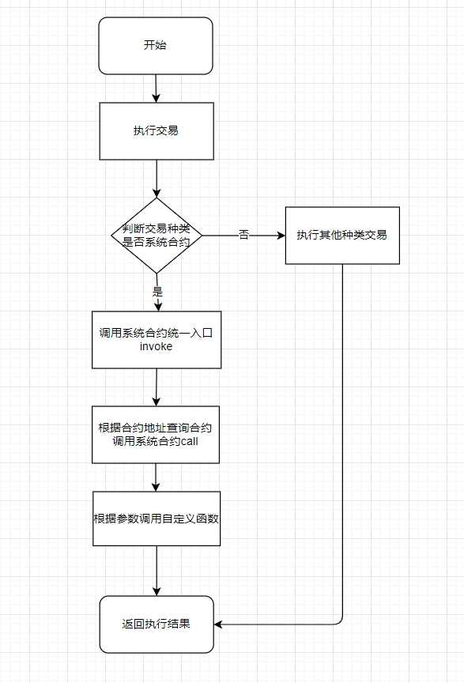
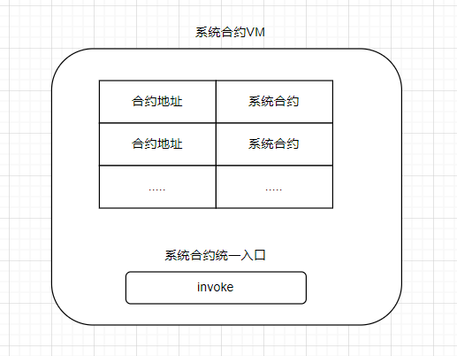
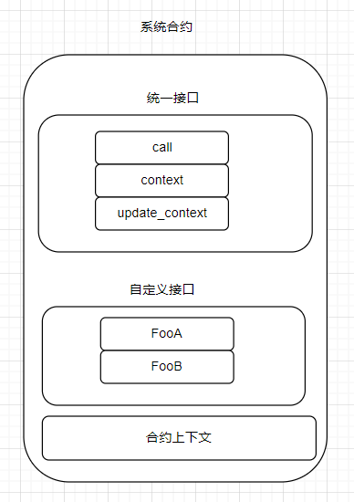

# 系统合约介绍

系统合约是geno链设计的一套可以完成复杂逻辑的框架，它具有同evm，wasm类似可以写复杂的逻辑优点，但是又没有虚拟机执行慢的缺点。

#### 系统合约调用流程

#### 系统合约架构

##### 系统合约VM

包含所有的系统合约，根据合约地址可以查到具体的系统合约，有统一的调用入口invoke

##### 系统合约

系统合约由三部分构成：统一接口、自定义接口、合约上下文

1. 统一接口 

   统一接口包含三个接口call、context、update_context. 三个接口必须实现

   call : 注册合约所有的自定义接口，调用update_context更新上下文，根据参数调用自定义的接口

   update_context： 更新合约上下文

   context：调用本合约的上下文

   

2. 自定义接口

   每个合约的业务接口，实现合约的具体功能

   

3. 合约上下文

​		包含合约相关和区块相关的信息

##### 合约上下文

包含合约相关和区块相关的信息

contract_name：合约名称

contract_address：合约地址

founder_address：合约创建者

invoker_address：调用合约的账号地址

itself：合约账号

invoker：调用合约的账号

block_height：当前区块高度

block_timestamp：当前区块时间戳

transaction_hash：出发本合约的交易的哈希

read_storage：读取合约存储

write_storage：写入合约存储

