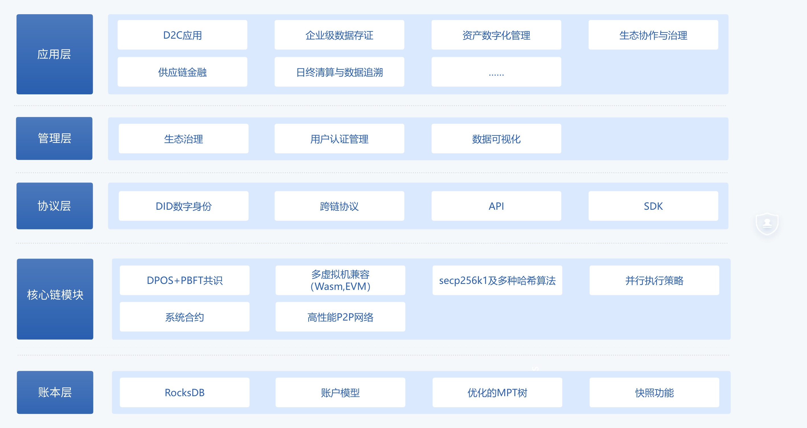

# 项目简介

## 背景

为满足企业级应用对区块链技术的高性能、高隐私性和高扩展性需求，我们研发了一套自有的联盟链系统。随着区块链技术在各行业的普及，现有的联盟链方案在性能、扩展性及定制化方面存在一定局限，无法完全满足复杂业务场景的需求。

我们选择开发自研联盟链，主要基于以下考量：

- **满足行业特定需求**：现有联盟链多为通用型设计，难以深度适配行业需求。而我们的自研联盟链能够提供场景化定制能力，精准服务于汽车、金融等重点领域。
- **优化性能与隐私**：在性能方面，通过创新共识算法及优化存储方案，自研联盟链显著提升了交易吞吐量和网络延迟表现。在隐私保护上，集成了先进的零知识证明和选择性披露技术。
- **增强技术自主可控性**：避免对外部开源技术的过度依赖，降低潜在技术风险并掌控系统演进方向。

通过模块化设计，我们的联盟链全面支持企业级场景的复杂需求，融合了现代密码学技术与创新共识算法，兼容主流区块链生态，旨在为开发者和企业用户提供强大、灵活且高效的区块链基础设施。其主要优势在于：

- 深度支持企业需求的场景化定制。
- 提供高性能和低延迟的区块链操作。
- 内置先进的隐私保护机制，符合多行业的数据安全要求。

## 核心架构设计

系统整体采用分层架构，主要分为以下层次：

1. **应用层**：
   1. 支持消费者与品牌之间的直接交互，为积分生态系统、供应链管理及资产数字化应用提供服务。
   2. 应用包括 D2C 模式积分系统、数据追踪追溯及多币种支付的实时清算功能。
2. **管理层**：
   1. 包括生态治理、用户认证管理、数据可视化等管理。
   2. 集成底层链管理工具、用户密钥管理及分布式存储管理。
   3. 实现细节：生态治理通过链上提案与投票模块支持动态调整规则，用户权限由密钥管理模块加密存储，保证节点安全。
3. **协议层**：
   1. 实现链特有功能，例如数字身份（DID）、跨链协议、链治理机制。
   2. 提供开放的 API 和 SDK 以支持第三方开发。
4. **核心链模块**：
   1. 包括基于 DPOS+PBFT 的共识机制、支持多虚拟机机制（当前兼容 Wasm）的合约虚拟机、多层次存储引擎和隐私保护模块。
   2. 集成高性能的 P2P 网络，用于节点间的高效通信。
   3. 支持系统合约，简化链上治理与升级操作。
   4. 集成现代加密算法，包括 secp256k1 和多种哈希算法，保障数据的机密性与完整性。
   5. 提供模块化设计，支持在不影响核心功能的情况下快速扩展链功能。
5. **账本层**：
   1. 账本设计采用状态树与区块链数据分离的存储方式。
   2. 提供交易池、账户模型、优化的MPT 树等模块以提高系统吞吐量。
   3. 实现细节：账本层支持快照功能，可快速恢复系统状态，同时优化了大规模节点同步性能。

## 技术特点

### 高性能

1. **并行合约执行**：采用基于 MVCC 的 Block-STM 机制，在交易执行中避免冲突并提高效率。
   1. 性能数据：单区块最大支持 10,000 笔交易并行执行，吞吐量可达 15,000 TPS（交易每秒）。
2. **优化交易广播**：通过消息去重和分层广播机制，减少网络开销。
   1. 实际表现：节点间同步延迟小于 200ms，在复杂网络环境下依然能够保持数据一致性。
3. **高效存储方案**：使用RocksDB存储引擎，结合分层缓存机制实现高效数据读写。
   1. 测试结果：单节点存储访问性能可达 50,000 次读写操作每秒。
4. **动态资源分配**：根据当前交易量动态分配计算与存储资源，提升处理能力。
   1. 典型场景：在流量突增情况下，动态调整 CPU 和内存使用率，确保系统稳定性。

### 强隐私

1. **选择性披露**：通过零知识证明技术，实现最小化敏感信息披露。
2. **隐私交易支持**：结合环签名与一次性地址技术，确保交易隐私性。
3. **分布式身份（DID）**：支持去中心化身份管理，可验证声明以及隐私保护的数字身份系统。
4. **合规性支持**：满足国际与区域隐私数据保护标准，如 GDPR 和中国网络安全法。

### 高扩展性

1. **多共识算法插件**：支持根据业务需求选择不同的共识算法。
2. **跨链能力**：通过标准化跨链协议支持与其他区块链的互操作性。
3. **系统升级机制**：支持智能合约和底层虚拟机的动态升级，保证业务持续性。
4. **模块化设计**：允许用户根据需求选择扩展功能，例如定制化存储引擎或特定行业的功能模块。

## 应用场景

1. **D2C积分系统应用**：
   1. 在消费者与品牌之间搭建直接交互的积分生态，提供精准的奖励分配机制。
   2. 案例：基于 D2C 模式的积分系统，通过区块链技术直接连接品牌与消费者，实现积分的快速流转与兑换。
2. **企业级数据存证**：
   1. 提供高效、安全的数据记录与变更追溯能力。
   2. 案例：分布式物流数据上链管理，用于追踪供应链中各环节的操作情况。
3. **资产数字化管理**：
   1. 链上原生支持多种资产类型的发行、转移及查询，并结合隐私保护技术，保障资产数据的安全性。此外资产发行人通过管理委员会投票选举。
   2. 案例：通过区块链技术构建跨境支付平台，支持多币种实时清算与交易透明化。
4. **生态协作与治理**：
   1. 提供标准化接口与智能治理工具，支持多方协作业务场景。
   2. 案例：链上提案机制协作调整信用评分模型，提升跨机构合作效率。
5. **供应链金融**：
   1. 提供链上可信资产流转能力，简化融资流程，降低运营成本。
   2. 案例：在物流链项目中，虚拟机插件实现了货物状态实时更新与链上验证。
6. **日终清算与数据追溯**：
   1. 利用区块链技术确保每日交易的清算准确性和高效性，支持全链路数据的实时追踪和历史溯源。
   2. 案例：金融机构通过账本层快照功能，实现日终交易清算的自动化，确保账务数据的完整性和可审计性。

## 开发者支持

- **灵活的 SDK**：
  - 提供离线签名功能，兼容多种 Java 版本（JDK1.8 和 JDK17）。
  - 集成现代密码学工具类功能，支持 secp256k1 算法钱包创建、零知识证明应用，以及多种哈希算法的实现，全面提升数据安全性。
  - 支持快速集成的模板代码与示例工程，降低开发上手难度。
- **完善的文档与工具链**：提供详尽的开发文档与调试工具，降低开发难度。
  - 文档涵盖开发、部署与运维全流程。
  - 提供可视化开发工具，如智能合约 IDE 和链状态监控仪表盘。

## 展望

未来，我们将持续优化联盟链的性能、隐私保护及开发者体验，进一步推动区块链技术在企业级应用场景中的普及与创新。同时，我们将：

- 深入探索区块链与物联网、AI 技术的结合，拓展更多应用场景。
- 继续深耕汽车行业的企业级应用解决方案，同时开发更多行业解决方案模块，如针对金融、医疗、教育等领域的定制化支持。
- 建立完善的技术支持与培训体系，赋能更多开发者与企业用户。