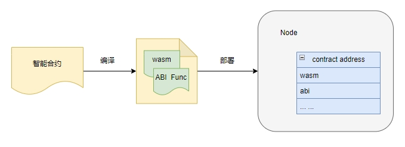
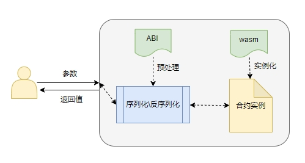

# 合约交互——ABI

## Geno ABI
智能合约相关数据在区块链上存储的格式都是字节码的形式，用户是无法直接阅读与操作的；虽然字节码提高程序的效率，但是对用户则是不友好的。我们通过`Geno ABI`描述智能合约的接口，包括字段名称、字段类型、方法名称、参数名称、参数类型、方法返回值类型等。`Geno ABI`由创建合约时生成，用户借助`Geno ABI`可以直接使用`Json`格式的数据与合约进行交互；

## Geno ABI 框架
我们编译智能合约的源码，会根据合约中标记同时生成和合约`ABI`相关解析函数，这些函数也会存入智能合约中。在我们要按照合约的时候，由链上解析出这些函数，然后生成`Geno ABI`文件，存到合约账户树下。



如果用户要调用智能合约时，输入的参数可以直接使用json，然后由schema转换为智能合约可以识别的字节码；智能合约的返回值也可以由schema转换为方便用户阅读的json格式。
用户所有和智能合约相关的操作，都是使用json，为什么是使用json。因为json是完全独立于编程语言的文本格式来存储和表示数据。简洁和清晰的层次结构使得json成为理想的数据交换语言。易于人阅读和编写，同时也易于机器解析和生成。



## Geno ABI 类型标记
为了编译出`ABI`，我们需要在编写智能合约的时候，进行标记我们需要生成`ABI`的数据；主要包括智能合约的状态，函数的输入参数和返回结果；由于我们是使用rust编写智能合约，所以需要给这些部分添加`SchemaType`的宏。例如：
```rust
#[derive(SchemaType)]
Struct ContractState{
  … …
}
```
### 标记智能合约状态
我们通过`#[contract_state(contract = … )] `指定某个数据结构作为智能合约的状态。
```rust
#[contract_state(contract = "contract_name")]
#[derive(SchemaType)]
struct ContractState {
   ... ...
}
```

### 标记函数的参数
标记合约方法的输入参数，包括了初始化合约的参数，以及普通的调用参数；
可以使用`#[init(contract = "contract_name", parameter = "Init_Parameter")]`指定智能合约的初始化函数的参数`Init_Parameter`，以及`#[receive(contract = "contract_name", name = "receive_name", parameter = "Receive_Parameter")]`指定智能合约的调用函数的参数`Receive_Parameter`。

```rust
#[derive(SchemaType)]
struct Init_Parameter { ... }

#[derive(SchemaType)]
enum Receive_Parameter { ... }

#[init(contract = "contract_name", parameter = "Init_Parameter")]
fn contract_init<...> (...){ ... }

#[receive(contract = "contract_name", name = "receive_name", parameter = "Receive_Parameter")]
fn contract_receive<...> (...){ ... }
```

### 标记函数的返回值
使用`#[receive(contract = "contract_name", name = "receive_name", result = "result")]`指定调用函数的返回值`Receive_Result`。

```rust
#[derive(SchemaType)]
enum Receive_Result { ... }

#[receive(contract = "contract_name", name = "receive_name", result = "Receive_Result")]
fn contract_result<...> (...){ ... }
```

## Geno ABI 类型对照表

合约内部定义的数据结构，对应用户与合约交互时，使用的`Json`结构。

| **Rust**                          | **Json**                              | **示例**                                                                                                                                                                                            |
| --------------------------------- | ------------------------------------- | --------------------------------------------------------------------------------------------------------------------------------------------------------------------------------------------------- |
| u8,u16,u32,u64,<br>i8,i16,i32,i64 | Number                                | `{ "age":30 }`                                                                                                                                                                                      |
| Amount                            | String                                | `"123456789"`                                                                                                                                                                                       |
| AccountAddress                    | String                                | `"0x1b93ce17644b8f2d2caa46629fb2dda98ae7ee1e"`                                                                                                                                                      |
| U128, I128                        | String                                | `"123456789"`                                                                                                                                                                                       |
| timestamp                         | String,使用RFC3339格式，精度为毫秒    | `"2020-12-11T11:38:37Z"`                                                                                                                                                                            |
| Duration                          | String,是一个用空格分隔的时间量度列表 | `"10d 1h 42s 1h"`                                                                                                                                                                                   |
| Pair                              | Array                                 | `Pair(U8, AccountAddress)` -> `[200, "0x1b93ce17644b8f2d2caa46629fb2dda98ae7ee1e"]`                                                                                                                 |
| List,Set,Array                    | Array                                 | `[0, 1, 1, 2, 3, 5, 8, 13, 21, 34]`                                                                                                                                                                 |
| Map                               | Array                                 | `Map(AccountAddress, U64)` -> `[ ["0x1b93ce17644b8f2d2caa46629fb2dda98ae7ee1e", 0],["0x1b93ce17644b8f2d2caa46629fb2dda98ae7ee1f", 15000000],["0x1b93ce17644b8f2d2caa46629fb2dda98ae7ee1g", 12400]]` |
| Struct                            | Object                                | `struct Person { id: u32,age: u8}` ->  `{"id": 500,"age": 35}`                                                                                                                                      |
| Enum                              | Array                                 | `enum Request { TransferTo(AccountAddress, u64)}` -> `{ "TransferTo":["0xdce0c7cb2b3265fbc1ee2d5092bcbb8d50d9e3a3",99]}`                                                                            |
| String                            | String                                | `"abcd"`                                                                                                                                                                                            |