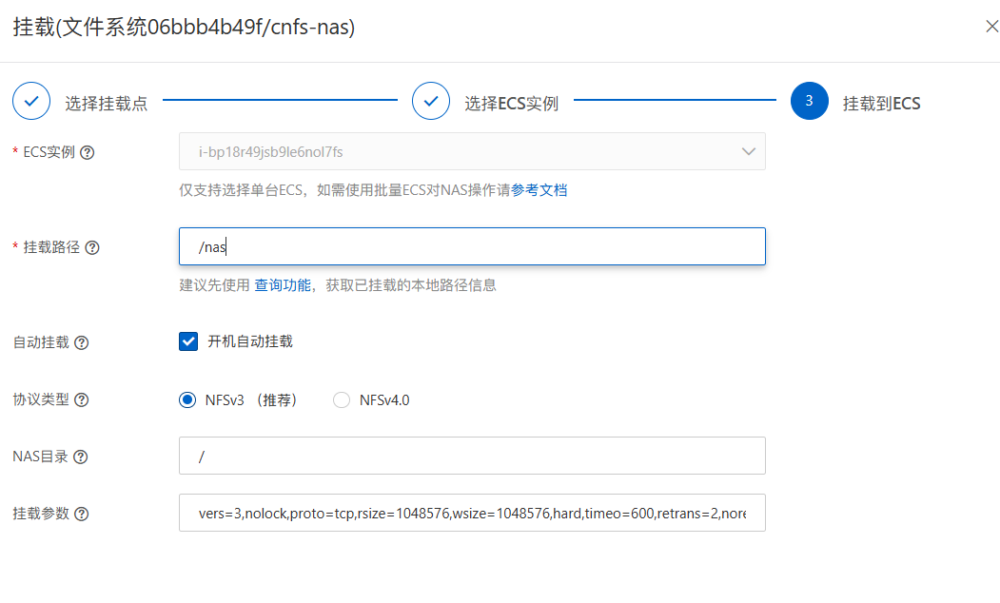

# Kubernetes 部署方案

1. 修改Dockerfile

```bash
# 使用基础镜像，例如 Ubuntu
FROM ubuntu:20.04

# 创建应用目录
RUN mkdir -p /etc/genochain/configs

# 将可执行文件拷贝到 /usr/local/bin，并赋予执行权限
COPY ./geno /usr/local/bin/geno
RUN chmod +x /usr/local/bin/geno

# 拷贝日志过滤配置（可选）
COPY ./configs/log_filter.txt /etc/genochain/configs/log_filter.txt

# 拷贝默认的 config.toml，K8s ConfigMap 挂载时可覆盖此文件
COPY ./configs/config.toml /etc/genochain/configs/config.toml

# 设置工作目录
WORKDIR /etc/genochain

# ENTRYPOINT 指向二进制，CMD 提供默认参数，可在 Deployment 中用 args 覆盖
ENTRYPOINT ["/usr/local/bin/geno"]
```

2. 构建镜像

```bash
docker build -t genochain:v1.0 .

```

3. 推送镜像到镜像仓库

```bash

docker login --username=Geno_admin@1692586812968618 geno-registry.cn-hangzhou.cr.aliyuncs.com
docker tag [ImageName] geno-registry.cn-hangzhou.cr.aliyuncs.com/web3/[ImageName]:[镜像版本号]
docker push geno-registry.cn-hangzhou.cr.aliyuncs.com/web3/[ImageName]:[镜像版本号]

```

4. 登录堡垒机k8s服务器

```bash
http://120.26.10.173/
admin
Kf0rm@d48.%94wvAFTs!Qx
选择jenkins服务器即可操作k8s集群

```

5. 修改 `Config.toml` 配置文件

```bash
## This is a TOML document. Boom.
network_id = 20250520
chain_id = "2025"
ssl_enable = false
node_address = "did:geno:0x8efd52de5102d1e9c3d7b855b8203aac0a875c4d"
node_private_key = "83d842cfb81854e42646eea93a5fcbe4131d9371d262efe1d48602b8790cd50eb0a4769bfa9a7f3b8eb2a1c401da2764e46b11dd8378bb58eb76ab5d401784c242ddb8b38e7833dd8e74a2fd3502ffb0"
key_version = 12356

[consensus]
proposal_commit_interval_ms = 10000
proposal_max_tx_size = 50000
proposal_max_contract_size = 500

[db]
key_vaule_max_open_files = 1000
kv_db_path = "./data/kv.db"
block_db_path = "./data/block.db"
state_db_path = "./data/state.db"

[genesis_block]
genesis_account = "did:geno:0x2bcc9962f7c1b2e60703e481e625e6aa9d66b7d7"
validators = ["did:geno:0xaacf6f16656467c219b828ebc8d90baa5600a684","did:geno:0x8efd52de5102d1e9c3d7b855b8203aac0a875c4d","did:geno:0x322975bd6605649fc377cb57cc8ff55db3ec86ad","did:geno:0xc3345963c4c0e6e2ed742ecffc5b6bef39c34694"] 
system_contract_manager = "did:geno:0x7e0bd320ef1e92280528db84fa129a628660a7b2"
asset_committee = ["did:geno:0xdfd3b156079103e803da1fcd2801d69743e3340f","did:geno:0x309300600112dd0b351ce9581d6a8ed752b36bd4","did:geno:0x7c58bc765ea75cd8898f68cbae2be2b3b1faebe8"] 
asset_issuer = "did:geno:0xa6242a92bcbb0b29fb6012b08a6832f40ccb810d"

[json_rpc]
address = "0.0.0.0:8080"
batch_size_limit = 20
page_size_limit = 1000
content_length_limit = 1048576

[ssl]
chain_file = "config/node.crt"
private_key_file = "config/node.pem"
private_password = "42001df2a1f54974baa38073eae2ee53"
dhparam_file = "config/dh2048.pem"
verify_file = "config/ca.crt"

[p2p]
codec_type = "default"
local_addr = "blockchain2.web3.svc.cluster.local:9333"
heartbeat_interval = 60
target_peer_connection = 50
max_connection = 2000
connect_timeout = 5
listen_addr = "0.0.0.0:9333"
known_peers = ["blockchain1.web3.svc.cluster.local:9333","blockchain2.web3.svc.cluster.local:9333","blockchain3.web3.svc.cluster.local:9333","blockchain4.web3.svc.cluster.local:9333"]
consensus_listen_addr = "0.0.0.0:9444"
consensus_known_peers = ["blockchain1.web3.svc.cluster.local:9444","blockchain2.web3.svc.cluster.local:9444","blockchain3.web3.svc.cluster.local:9444","blockchain4.web3.svc.cluster.local:9444"]

[tx_pool]
capacity = 1_00_000
capacity_per_user = 1000
transaction_timeout_secs = 300
transaction_gc_interval_ms = 60_000
broadcast_batch_size = 20
broadcast_interval_ms = 1000
max_concurrent_number = 10

```

6. 将阿里云的NAS挂载到K8S集群的所有的ECS实例上



7. 修改k8s部署脚本

```bash
#!/bin/bash
set -e

# 要部署的节点名称列表（对应四份不同的 config 文件：blockchain1.toml … blockchain4.toml）
NODES=("blockchain1" "blockchain2" "blockchain3" "blockchain4")

# Kubernetes 命名空间
NAMESPACE="web3"

# 数据存储目录前缀（同样需事先在每台宿主机上 mkdir -p /data/genochain/<节点名>）
# DATA_PREFIX="/data/genochain"

# 数据存储目录前缀改为NAS路径（确保K8S中所有节点均已挂载了阿里云的NAS,其挂载路径为/nas,并在nas上创建/genochain文件夹，从而每个k8s节点都能访问到/nas/genochain）
DATA_PREFIX="/nas/genochain"

for NODE in "${NODES[@]}"; do
  echo "=== 部署节点：$NODE ==="

  # 1. Deployment
  cat <<EOF > ${NODE}-deployment.yaml
apiVersion: apps/v1
kind: Deployment
metadata:
  name: $NODE
  namespace: $NAMESPACE
  labels:
    app: $NODE
spec:
  replicas: 1
  selector:
    matchLabels:
      app: $NODE
  template:
    metadata:
      labels:
        app: $NODE
    spec:
      restartPolicy: Always
      terminationGracePeriodSeconds: 30
      imagePullSecrets:
        - name: registry-aliyun-acr
      containers:
        - name: $NODE
          image: geno-registry-vpc.cn-hangzhou.cr.aliyuncs.com/web3/genochain:v3.0
          imagePullPolicy: IfNotPresent
          ports:
            - name: p2p
              containerPort: 9333
            - name: rpc
              containerPort: 9444
            - name: http
              containerPort: 8080
          resources:
            limits:
              cpu: "1"
              memory: 4Gi
            requests:
              cpu: 500m
              memory: 2Gi
          volumeMounts:
            # 区块链数据卷
            - name: data
              mountPath: /etc/genochain
            # 从 ConfigMap 挂载整个 configs 目录
            - name: config
              mountPath: /etc/genochain/configs
            # 时区同步
            - name: timezone
              mountPath: /etc/localtime
      volumes:
        - name: data
          hostPath:
            path: ${DATA_PREFIX}/${NODE}
            type: DirectoryOrCreate
        # 使用手动创建的 ConfigMap（命名为 blockchainX-cfg）
        - name: config
          configMap:
            name: ${NODE}-cfg
        - name: timezone
          hostPath:
            path: /etc/localtime
            type: File
EOF

  # 2. Service（ClusterIP，多端口）
  cat <<EOF > ${NODE}-service.yaml
apiVersion: v1
kind: Service
metadata:
  name: $NODE
  namespace: $NAMESPACE
spec:
  selector:
    app: $NODE
  ports:
    - name: p2p
      protocol: TCP
      port: 9333
      targetPort: 9333
    - name: rpc
      protocol: TCP
      port: 9444
      targetPort: 9444
    - name: http
      protocol: TCP
      port: 8080
      targetPort: 8080
  type: ClusterIP
EOF

  # 3. 应用到集群
  kubectl apply -f ${NODE}-deployment.yaml
  kubectl apply -f ${NODE}-service.yaml

  echo "节点 $NODE 部署完成。"
done

echo "所有区块链节点已部署。"

```

- 服务器上(可以执行k8s命令的服务器)创建下列目录，并放入修改好的配置文件
  /data/configs/blockchain1.toml
  /data/configs/blockchain2.toml
  /data/configs/blockchain3.toml
  /data/configs/blockchain4.toml
  /data/configs/log_filter.txt

- 使用k8s命令创建包含两个文件的ConfigMap
  
```bash
kubectl -n web3 create configmap blockchain1-cfg \
  --from-file=config.toml=/data/configs/blockchain1.toml \
  --from-file=log_filter.txt=/data/configs/log_filter.txt
#blockchain2，blockchain3，blockchain4同理

```

8. 执行k8s部署脚本

```bash
chmod 777 docker.sh
./docker.sh

```

9.  配置文件更新

更新完配置文件后，需要执行以下命令，重启pod

```bash
kubectl -n web3 create configmap blockchain1-cfg \
  --from-file=config.toml=./configs/blockchain1.toml \
  --from-file=log_filter.txt=./configs/log_filter.txt \
  --dry-run=client -o yaml \
| kubectl apply -f -

kubectl rollout restart deployment blockchain1 -n web3

```