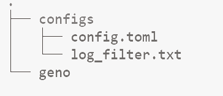

# 单节点快速启动教程

#### 目录结构



按照此目录结构上传执行文件和配置文件


#### 配置日志文件

修改log_filter.txt ，日志级别：trace、debug、info、warning、error


#### 配置节点文件

修改config.toml

```
# This is a TOML document. Boom.
network_id = 8108773
chain_id = "2024"
ssl_enable = false
node_address = "did:geno:0x160b54be617f4bff07bd6c994fc6dd17a69d5e4e"
node_private_key = "43f47b5387b5321a712c5960074576b114835aa8e1ce1c2e6ab070d7ffb44346"
key_version = 12356

[consensus]
proposal_commit_interval_ms = 10000
proposal_max_tx_size = 10000
proposal_max_contract_size = 2500

[db]
key_vaule_max_open_files = 1000
kv_db_path = "./data/kv.db"
block_db_path = "./data/block.db"
state_db_path = "./data/state.db"

[genesis_block]
genesis_account = "did:geno:0xf6b02a2d47b84e845b7e3623355f041bcb36daf1" 
validators = ["did:geno:0x160b54be617f4bff07bd6c994fc6dd17a69d5e4e"]
system_contract_manager ="did:geno:0x109e45bbc6b3c29012f23e7881a0f6209fb34325" 
asset_committee=["did:geno:0xed1bad1e68288932eba3fe495949ec76d41533ab","did:geno:0xb10bad2e5eb7fa380dd00ac782549f9d2abeb8dc","did:geno:0x99f56d55790c5095d23ac3a02aca47e840acb569"]
asset_issuer="did:geno:0x052c4dc8f39a0dcf0024e06499cde38eb4cbdf99" #priv 2e2a44db043184413add6e84a7ca151db7fc024cc741af5aa62e26e66cbb9001

[json_rpc]
address = "0.0.0.0:8081"
batch_size_limit = 20
page_size_limit = 1000
content_length_limit = 1048576

[ssl]
chain_file = "config/node.crt"
private_key_file = "config/node.pem"
private_password = "42001df2a1f54974baa38073eae2ee53"
dhparam_file = "config/dh2048.pem"
verify_file = "config/ca.crt"

[p2p]
codec_type = "default"
local_addr = "127.0.0.1:19301"
heartbeat_interval = 60
target_peer_connection = 50
max_connection = 2000
connect_timeout = 5
listen_addr = "0.0.0.0:19301"
known_peers = []
consensus_listen_addr = "0.0.0.0:19401"
consensus_known_peers = []


[tx_pool]
capacity = 1_000_000
capacity_per_user = 10000
transaction_timeout_secs = 600
transaction_gc_interval_ms = 60_000
broadcast_batch_size = 30
broadcast_interval_ms = 1000
max_concurrent_number = 10

```

单节点genesis_block的validators 只能配置自身节点的node_address

单节点p2p的known_peers和consensus_known_peers都不需要配置

单节点只适用于开发者模式，调试节点运行过程。


#### 启动节点

###### 前台运行

```
./geno
```


###### 后台运行

```
nohup ./geno >output.log 2>&1 &
```


###### pm2启动运行

配置geno配置文件geno.json

```
{
    "apps": [
        {
            "name": "n1",
            "script": "./geno",
            "cwd": "/work/n1/",
            "instances": 1,
            "error_file": "./log/geno.log",
            "out_file": "./log/geno.log",
            "log_date_format": "YYYY-MM-DD HH:mm Z"
        }
    ]
}
```

```
pm2 start geno.json 启动节点
```

