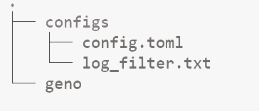

# 依赖软件与工具安装

### 编译安装

###### 安装编译前依赖

```
sudo apt update && apt upgrade -y
sudo apt install pkg-config 
sudo apt install curl build-essential gcc make libssl-dev clang -y
curl --proto '=https' --tlsv1.3 -sSf https://sh.rustup.rs | sh

激活rust环境
source ~/.cargo/env
```


###### 编译源码

```
cargo build --release
```

编译结果在源码/targer/release/geno下


###### 目录结构



config.toml 节点配置文件

log_filter.txt 日志配置文件

geno 节点执行文件


